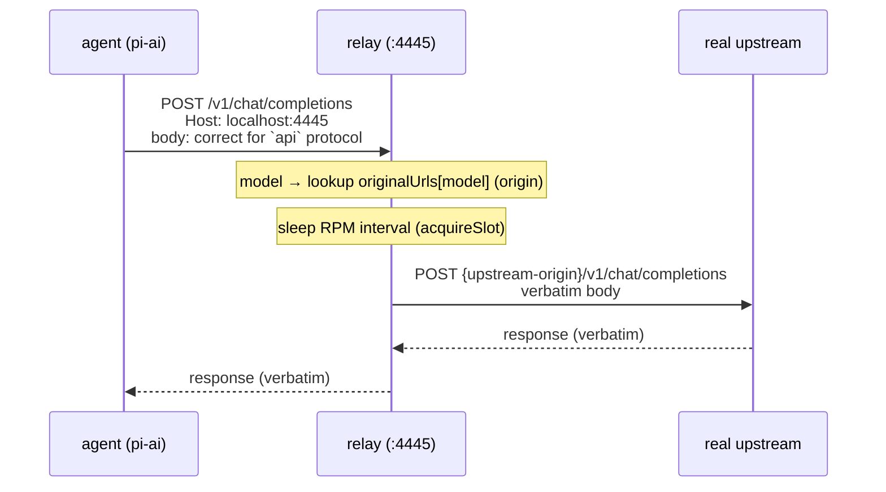

# AGENTS.md

## Goal

Noodle is a self-hosted GitHub bot that uses AI coding agents to automate bug finding and code improvement across a codebase. It listens for GitHub events, clones the repository, runs an AI agent on an isolated branch, and delivers results back as PRs or issues.

### How it works

1. **User triggers the agent** from one of four entry points:
   - **Issues** — open/reopen an issue, or comment with `@mention`, `/command`, or `#profile` tag
   - **PRs** — comment on an open PR with `@mention`, `/command`, or `#profile` tag
   - **Events** — any GitHub webhook event matching a stored trigger rule (push, PR lifecycle, etc.)
   - **Schedules** — cron jobs that run on a configurable interval

2. **Noodle clones the repo** and creates an isolated branch:
   - **Issue mode (no open PR)**: fresh branch `<agent>/issue-<N>` off the default branch. Opens a new PR targeting the default branch.
   - **Issue mode (open PR exists)**: fresh branch `<agent>/issue-<N>` derived from the PR's branch. Opens a **stacked PR** targeting the existing PR's branch.
   - **PR comment mode**: fresh branch derived from the PR's branch. Opens a **stacked PR** targeting the existing PR's branch.
   - **Cron/Trigger mode**: long-lived branch that stacks across runs for traceability.

3. **The AI agent runs** on the cloned branch with a system prompt + the user's task:
   - Issue/PR: the issue title, body, comments, and URL are injected into the prompt
   - Cron/Trigger: a freeform task prompt plus event context (for triggers)

4. **Results are delivered**:
   - **Issue mode (no open PR)**: commits changes, pushes branch, opens a PR with `Fixes #N`, posts a comment on the issue
   - **Issue mode (open PR exists)**: commits changes, pushes branch, opens a **stacked PR** targeting the existing PR's branch, posts a comment on the issue
   - **PR comment mode**: commits changes, pushes branch, opens a **stacked PR** targeting the existing PR's branch, posts a comment on the PR
   - **Cron/Trigger mode**: commits changes, pushes branch, opens a **new issue** with the agent's findings

### Summary

| Mode | Trigger | Branch | Output |
|------|---------|--------|--------|
| Issue (no open PR) | Issue opened/commented with `@`, `/cmd`, `#tag` | `<agent>/issue-<N>` off default branch | New PR targeting default branch |
| Issue (open PR exists) | Same as above | `<agent>/issue-<N>` derived from PR branch | Stacked PR targeting existing PR |
| PR Comment | Comment on PR with `@`, `/cmd`, `#tag` | Fresh branch derived from PR branch | Stacked PR targeting existing PR |
| Cron | Timer (configurable interval) | Long-lived, stacked | New issue with findings |
| Trigger | Any webhook event matching stored rules | Long-lived, stacked | New issue with findings |

### Key design decisions

- **Stacked PRs**: when an existing PR is involved (PR comment or issue-with-PR), the agent creates a fresh branch from the PR's branch and opens a stacked PR on top of it — no force-push, no branch reuse
- **Opt-in by default**: issues don't trigger the agent unless they contain an `@mention`, keyword, `/command`, or `#profile` tag — or unless `trigger_on_open` is enabled
- **Concurrency control**: a `cooking` label prevents duplicate runs on the same issue/PR
- **Profile routing**: `#profile` tag > matched command's `profile` field > label match > keyword regex > default profile
- **Self-hosted**: runs on your own infrastructure, connects to your GitHub App or PAT, uses your chosen AI provider
- **Invisible relay**: the API relay (port 4445) is a dumb rate-limiting pipe. The agent points at a relay-facing `base_url` (e.g. `http://localhost:4445/v1` for OpenAI-compatible, `http://localhost:4445` for Mistral/Anthropic/Google — it mirrors the upstream's path shape) and believes that *is* the provider. The relay does two things and only two things: (1) swap the origin back to the real upstream's scheme+host, (2) sleep for the RPM interval. It forwards the request byte-for-byte. See [API relay (rate-limiting proxy)](#api-relay-rate-limiting-proxy) below.

### Prompting (input shaping)

Every run sends the agent a single user prompt assembled from a **base system prompt + extensions**. The base is always active; slash commands extend it; profile tags override only the profile. The composition is identical in structure across all three run paths (issue/PR, cron, trigger) — they differ only in which extensions apply.

**The base system prompt** (`system_prompt` setting in the DB, seeded by `seedDefaultSettings` in `src/server/ui-routes.ts`):
- Declares the agent's role (autonomous software engineer on a GitHub repo)
- Says to **always load `noodle-default`** — the always-active engineering mindset skill
- Says the final message IS the deliverable
- Carries a `{system}` tag that expands at runtime to the live system-info block (CPU/RAM/tier)

It's written to be **complete on its own** — a pure `@mention` run (no slash command) sends the base alone, with no framing slot filled. The agent never perceives a seam between the base and an extension.

**Extensions compose on top of the base:**

| Trigger | Base | Framing slot | Profile |
|---------|------|--------------|---------|
| `@noodle-agent` (pure mention) | ✓ active | empty | default/routed |
| `/noodle` | ✓ active | empty (builtin is a no-op — base already covers it) | default/routed |
| `/noodle-fix` | ✓ active | fix framing (loads `noodle-fix` skill) | default/routed |
| `/noodle-review` | ✓ active | review framing (loads `noodle-review` skill) | default/routed |
| `/custom-cmd` | ✓ active | that command's `system_prompt` | default/routed, or `cmd.profile` if set |
| `#GLM` | ✓ active | empty (no command matched) | **GLM** (tag override) |
| `/noodle-fix` + `#GLM` | ✓ active | fix framing | **GLM** |
| Custom cmd with `profile` set + `#GLM` | ✓ active | custom framing | **GLM** (tag wins over `cmd.profile`) |

**Priority rules:**
- **Profile**: `#profile` tag > matched command's `profile` field > label/keyword/default routing
- **Commands**: first match wins. `resolveByTrigger` (`src/server/command-store.ts`) scans segments newest-first (latest comment → issue body) and tests longest-trigger-first within each segment, so `/noodle-fix` beats `/noodle`. Multiple `/commands` in a thread → the most recent one wins.

**How the prompt is assembled** (issue/PR mode, `runJob` in `src/engine/run.ts`; cron/trigger mirror this in their own files):

1. `expandTags(baseSystemPrompt)` resolves `{system}`, `{system.tier}`, `{pr}`, `{issue}`, etc. to live data. If the base used `{system}`, the sysInfo block is already inlined — it's not appended again (avoids duplication).
2. The matched command's `system_prompt` (if any) is also `expandTags`-ed and placed in the framing slot.
3. `buildRunPrompt(framing, issue, comments, repo, fullSysInfo, isPR)` assembles: `[expanded base + sysInfo]` → `---` → `You are working on an issue/PR in <repo>` → `<framing>` → `## Issue/PR block + Discussion + URL`.

Cron/trigger use `buildSchedulerPrompt` / `buildTriggerPrompt` instead of `buildRunPrompt` (no issue context — they inject the freeform task + event context), but the base-system-prompt + expandTags prepend is identical.

**System info guidance** (`buildSysInfoGuidance` in `src/util/sysinfo.ts`): a compact facts block (CPU cores, memory, environment) plus a **one-liner** capability hint ("Resource-constrained — skip builds/tests" vs "Capable box — light verification OK"). The raw numbers + the one-liner let the agent infer what it can and can't do — no verbose explanation, to keep token count down. Shared by all three modes.

**Built-in commands** (`seedBuiltinCommand` in `src/server/command-store.ts`): `/noodle`, `/noodle-fix`, `/noodle-review` are seeded into the `commands` DB table on boot with `is_builtin = 1` (non-deletable). `/noodle`'s `system_prompt` is empty (the base covers it); the other two carry their skill-loading framing. User commands created via the UI extend the same mechanism. The DB is the single source of truth — `defaultCommandPrompt`/`fixCommandPrompt`/`reviewCommandPrompt` in `src/engine/prompt.ts` are only used to seed the builtins and as legacy fallbacks.

### Final messages & footer (output shaping)

Every run captures the agent's last assistant message (`extractLastAssistantText` in `src/engine/run.ts`), then shapes it into the delivered comment / PR body / issue body before posting. The shaping pipeline runs in every mode (issue, PR, cron, trigger) and has two stages:

1. **Phrasing** — the raw answer is passed through `phraseOutput` (`src/engine/title.ts`), a single LLM call to the local relay (port 4445, same model that just ran). This **cleans the presentation** — strips thinking-token residue, tool-call chatter ("Let me check…", "Running grep…"), fixes markdown headings/lists — but **never summarises**: its system prompt enforces "PRESERVE EVERY TECHNICAL DETAIL". Sibling to `generateIssueTitle` (used to title cron/trigger output issues), same relay pattern. Falls back to the raw message on any failure (relay down, empty result, throw), so a run is never blocked by phrasing.

2. **Footer** — appended after a `---` separator on every output (`buildFooter` in `src/engine/run.ts`): agent name, profile + model, cook time / tool calls / turns, token usage, cost (when priced), and a random fun line.

**Failed-state invariant:** phrasing is only reached in the **non-errored** branch. When the agent's own LLM call fails (`stopReason === "error"`), the run takes the template error path (`buildErrorComment` / `buildCronErrorBody` / `buildTriggerErrorBody`) and is marked `failed` — it is never routed through `phraseOutput`. Error bodies carry the footer too, so a triage list sees the same stats block regardless of outcome.

**Where each output is composed:**

| Builder | File | Used for | Body shape |
|---------|------|----------|------------|
| `buildPrBody` | `run.ts` | Issue/PR run with code changes | phrased answer + changed files + footer + `Closes <url>` |
| `buildIssueComment` | `run.ts` | Issue/PR run (no changes, or PR opened) | phrased answer + footer |
| `buildErrorComment` | `run.ts` | Issue/PR run errored | templated error notice + footer |
| `buildCronIssueBody` | `scheduler-run.ts` | Cron run succeeded | phrased findings + footer |
| `buildCronErrorBody` | `scheduler-run.ts` | Cron run errored | templated error notice + footer |
| `buildTriggerIssueBody` | `trigger-run.ts` | Trigger run succeeded | phrased findings + footer |
| `buildTriggerErrorBody` | `trigger-run.ts` | Trigger run errored | templated error notice + footer |

### Self-trigger suppression (no infinite loops)

The agent posts its output as comments and swaps labels. Without a guard, those actions would re-fire the webhook and trigger another run — e.g. an answer comment containing `@noodle` or `#GLM` in its text would wake the agent again the moment it's posted.

Noodle detects its **own** events via `sender.login` and ignores them — but only for the two action types that are outputs, never for inputs:

| Webhook event | When sent by the bot itself | Rationale |
|---------------|-----------------------------|-----------|
| `issue_comment.created` | **Suppressed** | A bot comment is an *output*, never a wake signal. This is the main loop guard — the answer comment's text can contain `@`, `/`, or `#` triggers. |
| `issues.labeled` | **Suppressed** | The bot's own `cooking` → `cooked` label swaps must not re-fire under `trigger_on_open`. |
| `issues.opened` / `reopened` | **NOT suppressed** | Cron/Trigger runs *open new issues* to deliver findings — that new issue must be able to chain into another agent run (see below). |
| `issues.assigned` | **NOT suppressed** (still scoped to the bot) | Assignment to the bot itself is always an unconditional wake. |
| Any event matched by a stored **Trigger** rule | **NOT suppressed** | The event-driven trigger path is the agent→agent chaining mechanism for Trigger mode. |

**Login matching** (`isSelfSender` in `src/github/webhook.ts`): comparison strips the GitHub-App `[bot]` suffix and is case-insensitive, so `selfLogin` set with or without `[bot]` matches a `<app-slug>[bot]` sender. In App mode `selfLogin` defaults to `<GITHUB_APP_SLUG>[bot]` (falls back to `<agent-slug>[bot]`, then `NOODLE_LOGIN` if set explicitly).

### Agent → agent chaining (Cron/Trigger mode)

In Cron and Trigger mode, the agent's output is a **new issue** (`gh.createIssue`), not a comment. That freshly-opened issue fires an `issues.opened` webhook, which:

- passes the opt-in wake filter when its body carries a wake signal (e.g. the agent's findings mention the agent name), and/or
- matches a stored **Trigger** rule (`push`, `issues`, `pull_request`, etc.)

Either path can enqueue another agent run. This is intentional — it lets a cron run surface a finding and have it picked up by a downstream agent. The self-trigger suppression rule above is deliberately **narrowed to comments and label swaps** so this chaining path keeps working: `issues.opened`/`reopened` from the bot itself are never suppressed.

### API relay (rate-limiting proxy)

The relay (`src/relay/server.ts` + `src/relay/forwarder.ts` + `src/relay/rate-limiter.ts`, always on `:4445`) is an **invisible dumb pipe** between the agent and the real AI provider. It exists for one reason: to enforce per-model RPM by sleeping before each forwarded request, so the provider never sends a 429.

**The invariant — the relay must be transparent to the agent.**

The agent is told a relay-facing `base_url` and believes that *is* the provider. It builds a request for whatever protocol the profile's `api` field declares and POSTs it. The relay's entire job is:

1. model → look up the upstream **origin** (scheme://host) from the `originalUrls` map (populated by `serve.ts`, updated live by profile CRUD in `ui-routes.ts`)
2. sleep for the RPM interval (`acquireSlot` in `rate-limiter.ts`)
3. **forward by origin-swap**: replace the relay origin with the upstream origin, keep the request path + body verbatim

The relay **does not** mutate the request body. It does not rewrite roles. It does not strip fields. It does not know or care which protocol is in use. The request is correct the moment the agent builds it, because the agent built it for the right `api` protocol. The relay is a wire with a timer on it.

**Why the relay never mutates the body.** Correctness lives in the **agent layer**, not the relay. pi-ai has 5 transports, picked by the profile's `api` field:

| `api` value | Transport | Body shape |
|-------------|-----------|------------|
| `mistral-conversations` | dedicated Mistral | Mistral-native (no `store`, no `developer` role, `max_tokens`) |
| `anthropic-messages` | dedicated Anthropic | Anthropic-native |
| `google-generative-ai` | dedicated Google | Google-native |
| `openai-responses` | OpenAI Responses API | OpenAI-native |
| `openai-completions` | generic OpenAI-compatible | OpenAI Chat Completions |

The 4 dedicated transports build a protocol-correct body regardless of which URL they're pointed at — so relaying them is trivially correct: pipe through. The generic `openai-completions` transport is the only one that does URL-sniffing (`detectCompat`) to guess field names (`max_tokens` vs `max_completion_tokens`, `store:false`, `developer` role). If a profile using that transport is aimed at a picky non-OpenAI upstream, compat must be set explicitly at registration (`registerCustomProviders` in `src/profiles/custom-providers.ts`) so pi-ai generates provider-safe fields itself — **never** patched by the relay after the fact.

**Why forward by origin-swap, not path-rebuild.** Each transport's SDK concatenates `baseURL + hardcoded-path` differently, and each hardcodes a different path:

| Transport | SDK | SDK default base | Hardcoded path | Upstream `base_url` shape |
|-----------|-----|------------------|----------------|---------------------------|
| `openai-completions` | OpenAI SDK | `…/v1` | `/chat/completions` | **with `/v1`** |
| `openai-responses` | OpenAI SDK | `…/v1` | `/responses` | **with `/v1`** |
| `anthropic-messages` | Anthropic SDK | bare host | `/v1/messages` | **bare host** |
| `mistral-conversations` | Mistral SDK | bare host | `/v1/chat/completions` | **bare host** |
| `google-generative-ai` | Google SDK | bare host | varies | **bare host** |

So the relay-facing `base_url` for each profile mirrors its upstream's path shape: `relayBaseUrl(upstream, origin)` = `http://localhost:4445` + `pathOf(upstream)`. If the user enters `https://api.openai.com/v1`, the agent sees `http://localhost:4445/v1` and the OpenAI SDK appends `/chat/completions`. If the user enters `https://api.mistral.ai` (bare host), the agent sees `http://localhost:4445` and the Mistral SDK appends `/v1/chat/completions`. In both cases the path that lands on the relay is correct for that protocol's upstream — so the relay just swaps the origin and forwards. No per-transport logic in the relay, ever. Helpers in `src/util/slugify.ts`: `originOf`, `pathOf`, `relayBaseUrl`, `relayForwardUrl`.

**Routing anatomy.**

The `originalUrls` map (`Map<model, originOf(base_url)>`) holds the upstream **origin** per model. It is populated at boot in `serve.ts` and kept live by profile create/update in `ui-routes.ts`. When `use_relay` is on, the profile's `base_url` is rewritten to the relay-facing URL (`relayBaseUrl(...)`) for the agent to see; the upstream origin is retained in `originalUrls` for the relay to forward to. The agent never sees the real URL; the relay never tells the agent anything.

**Internal LLM calls (phrasing, titles) use the same path.** `phraseOutput` and `generateIssueTitle` (`src/engine/title.ts`) POST to `http://localhost:4445/v1/chat/completions` using the run's resolved profile. The relay does its origin-swap and forwards. Same relay, same model lookup, same rate-limiting. The only difference is they use a tiny non-streaming request with a tight `max_tokens` cap.

**Common failure modes (and why they're fixed at the agent layer, not the relay):**

- **404 "no Route matched" from upstream** → the relay forwarded a path the upstream doesn't have. Root cause is ALWAYS a `base_url` shape mismatch between what the user entered and what the transport's SDK expects. The relay-facing URL must mirror the upstream's path shape (`relayBaseUrl(upstream, origin)`), and the relay must forward by pure origin-swap (`upstream-origin + req.url`). The earlier `ensureV1Suffix` approach forced `/v1` onto every upstream — wrong for Mistral/Anthropic/Google (their SDKs hardcode `/v1` themselves → double `/v1` → 404). Never add per-transport path logic to the relay.
- **422 `extra_forbidden` / unknown field** → the `openai-completions` transport generated an OpenAI-default field the upstream rejects (`max_completion_tokens`, `store`, `developer` role). Root cause: profile's `api` is `openai-completions` but pointed at a picky non-OpenAI upstream, and compat wasn't set explicitly. Fix `registerCustomProviders` to set safe compat for the generic case — do not strip fields in the relay.
- **429** → handled by `forwarder.ts` retry loop (Retry-After-aware, exponential backoff). Should be rare because the relay's RPM spacing prevents it; the retry is a safety net for transient platform 429s (e.g. shared NVIDIA NIM free tier).
